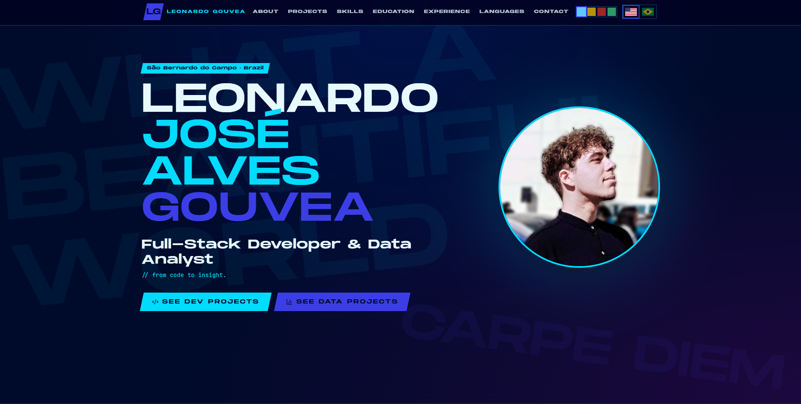
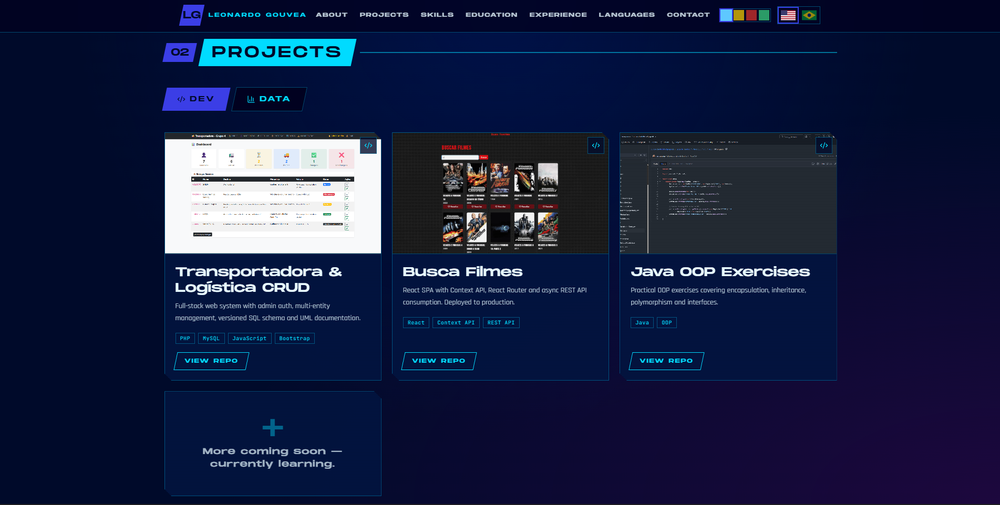
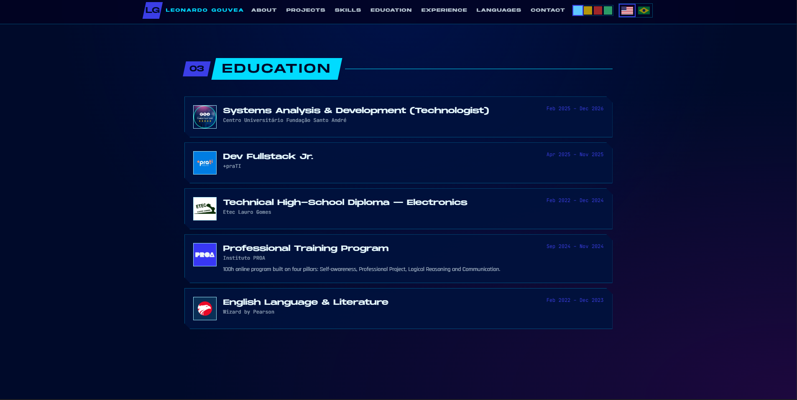
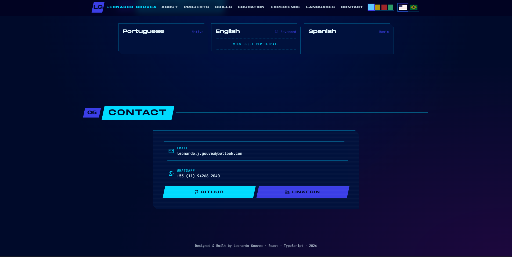

# Leonardo Gouvea — Developer Portfolio

> **"From code to insight."**

A personal portfolio showcasing my journey as a Full-Stack Developer, Data Analyst and Automation Engineer.

Built with React, TypeScript, Vite and Tailwind CSS, the project features a responsive interface inspired by modern video games, bilingual support and a modular architecture designed for long-term maintainability.

Designed with responsiveness, modularity and maintainability in mind, every section of the portfolio can be customized through centralized configuration files without modifying the UI components.

---

## 🌐 Live Demo

> https://portfolio-leogouvea.vercel.app/

---

## 📸 Preview

<div align="center">
  
</div>

<br/>

<table border="0" width="100%">
  <tr>
    <td width="50%" valign="top">
      <p align="center"><b>🎮 Home Screen</b></p>
      
    </td>
    <td width="50%" valign="top">
      <p align="center"><b>💼 Projects Gallery</b></p>
      
    </td>
  </tr>
  <tr>
    <td width="50%" valign="top">
      <p align="center"><b>🎓 Education Timeline</b></p>
      
    </td>
    <td width="50%" valign="top">
      <p align="center"><b>📫 Contact Form</b></p>
      
    </td>
  </tr>
</table>

---

# ✨ Features

- 🌎 Portuguese / English localization
- 🎨 Multiple color themes
- 📱 Fully responsive layout
- 🎮 Game-inspired interface
- 💼 Development & Data Analytics portfolio
- 📊 Interactive project cards
- 🎓 Education timeline
- 💼 Professional experience section
- 📫 Contact & social links
- ⚡ Fast Vite build
- 🧩 Modular architecture
- ♿ Accessible semantic HTML

---

# 🛠 Tech Stack

## Frontend

- React
- TypeScript
- Vite
- Tailwind CSS

## UI

- Lucide React
- React Icons
- shadcn/ui

## Tooling

- ESLint
- Prettier
- npm

---

# 📂 Project Structure

```
src
│
├── assets
│   ├── fonts
│   ├── images
│   └── logos
│
├── components
│   ├── portfolio
│   └── ui
│
├── data
│   └── site.ts
│
├── hooks
│
├── lib
│   ├── i18n.tsx
│   ├── theme.tsx
│   └── utils.ts
│
├── routes
│
└── styles.css
```

---

# 🎨 Customization

Almost every part of the portfolio can be customized without editing React components.

| Change | File |
|----------|------|
| Personal Information | `src/data/site.ts` |
| Projects | `src/data/site.ts` |
| Skills | `src/data/site.ts` |
| Education | `src/data/site.ts` |
| Experience | `src/data/site.ts` |
| Languages | `src/data/site.ts` |
| Hero Content | `src/lib/i18n.tsx` |
| Section Titles | `src/lib/i18n.tsx` |
| Theme Colors | `src/styles.css` |
| Typography | `src/styles.css` |
| Images | `src/assets/images` |
| Company / School Logos | `src/assets/logos` |

---

# 🏗 Architecture

The project follows a simple separation of responsibilities:

- **data/** stores all editable content.
- **components/portfolio/** contains the application UI.
- **components/ui/** contains reusable UI primitives.
- **lib/** centralizes translations, utilities and theme management.
- **assets/** stores fonts, images and logos.
- **styles.css** acts as the project's design system.

This architecture allows content updates without touching the component implementation.

---

# 🎮 Design Philosophy

This portfolio was built around three core principles:

### Clarity

Present technical information in a clean and organized way.

### Personality

Use a visual identity inspired by modern video game interfaces while remaining professional for recruiters and clients.

### Maintainability

Centralize editable content, themes and translations so future updates require minimal code changes.

---

# 🚀 Getting Started

Clone the repository

```bash
git clone https://github.com/leo-gouvea/portfolio
```

Enter the project

```bash
cd YOUR_REPOSITORY
```

Install dependencies

```bash
npm install
```

Start the development server

```bash
npm run dev
```

---

# 📦 Production

Build

```bash
npm run build
```

Preview

```bash
npm run preview
```

---

# 🚀 Deployment

This project is ready to be deployed on platforms like:

- Vercel
- Netlify
- GitHub Pages

---

# 📌 Future Improvements

- More Full-Stack projects
- More Data Analytics dashboards
- Blog section
- Project filtering
- Light mode redesign
- Unit tests
- Performance improvements

---

# 👨‍💻 About Me

I'm **Leonardo José Alves Gouvea**, a Brazilian **Full-Stack Developer**, **Data Analyst**, and **Automation Engineer** currently pursuing a degree in Systems Analysis and Development.

My interests include:

- Backend Development
- Data Analytics
- Business Intelligence
- ERP Systems
- Process Automation
- Artificial Intelligence
- User Experience

---

# 📫 Contact

**LinkedIn**

https://linkedin.com/in/leonardo-gouvea-ti

**GitHub**

https://github.com/leo-gouvea

**Email**

leonardo.j.gouvea@outlook.com

---

# 📄 License

This project is licensed under the MIT License.
